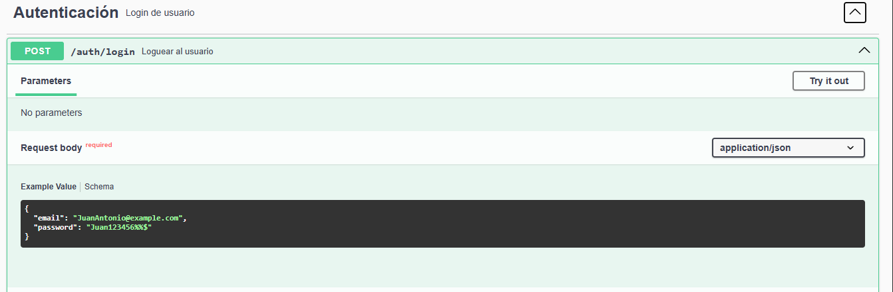
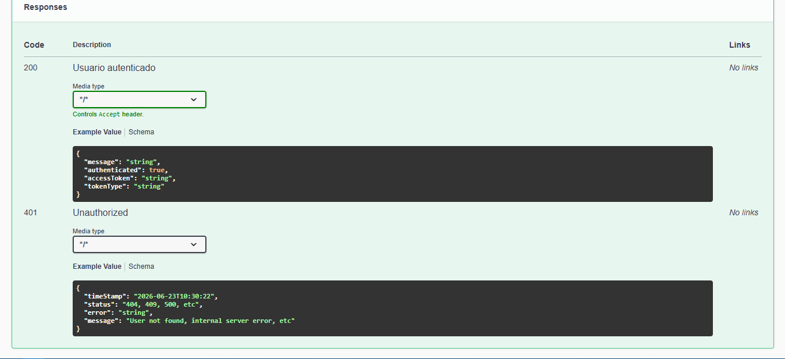

# 💻Sistema de gestión de prestamos y mantenimientos de equipos 
Backend de un sistema de gestión de activos tecnológicos desarrollado con 
**Java** y **Spring Boot**. El objetivo del proyecto es centralizar el control 
de equipos, usuarios y roles dentro de una organización, gestionando préstamos, mantenimientos y trazabilidad de los activos. El proyecto implementa una arquitectura RESTful, persistencia con PostgreSQL y buenas prácticas de desarrollo backend.


---

## 📑 Tabla de contenidos

- [Tecnologías usadas](#-tecnologías-usadas)
- [Modelo de la base de datos](#-modelo-de-la-base-de-datos)
- [Funcionalidades](#-funcionalidades)
- [Seguridad y autenticación (JWT)](#-seguridad-y-autenticación-con-jwt-y-spring-security)
- [Autorización basada en roles](#-autorización-basada-en-roles)
- [Documentación con Swagger](#-documentación-con-swagger)
- [Configuración del proyecto](#-configuración-del-proyecto)
- [Inicialización automática](#-inicialización-automática-de-la-aplicación)
- [Testing](#-testing)
- [Endpoints principales](#-main-endpoints)
- [Manejo de errores](#-api-error-handling)
- [Funcionalidades avanzadas de consulta](#funcionalidades-avanzadas-de-consultas)
- [Progreso del proyecto](#-progreso-del-proyecto)
- [Autor](#-autor)
---


## 🧰 Tecnologías usadas
- Java
- Spring Boot
- Spring Data JPA
- Spring Security
- PostgreSQL
- Maven


---

## 🗂 Modelo de la base de datos

**Entidades principales:** `Role`, `User`, `Equipment`, `Loan`, `Maintenance`


<p align="center">
  
</p>


<h5>Relaciones</h5>
<ul>
  <li>Role 1 → N User</li>
  <li>Equipment 1 → N Loan</li>
  <li>User 1 → N Loan (Receiver)</li>
  <li>User 1 → N Loan (Deliverer)</li>
  <li>Equipment 1 → N Maintenance</li>
  <li>User 1 → N Maintenance (Register)</li>
</ul>

---

## ⚙️ Funcionalidades

### Gestión de usuarios
- Consultar usuarios
- Crear usuarios
- Actualizar usuario
- Eliminar usuarios
### Gestión de roles
- Consultar roles
- Crear roles
- Actualizar roles
- Eliminar roles
### Gestión de equipos
- Consultar equipos
- Registrar equipos
- Actualizar equipos
- Eliminar equipos
### Gestión de préstamos
- Registrar préstamos de equipos
- Consultar historial de préstamos
- Consultar préstamo por ID
- Estados del préstamo: `ACTIVE`, `RETURNED`, `CANCELLED`
### Gestión de mantenimiento
- Consultar mantenimientos
- Registrar mantenimientos
- Actualizar estado del mantenimiento
- Estados del mantenimiento: `IN_PROGRESS`, `COMPLETED`, `CANCELLED`
### Manejo de excepciones globales
- Excepciones personalizadas para la lógica de negocio y recursos faltantes
- Respuestas de error HTTP estandarizadas (404, 409, 500)
- Gestión centralizada de excepciones con `@RestControllerAdvice`
---

## 🔐 Seguridad y autenticación con JWT y Spring Security

La API implementa un sistema de autenticación basado en **Spring Security** y **JSON Web Tokens (JWT)**, permitiendo proteger los recursos de la aplicación y controlar el acceso según el rol de cada usuario.

### ¿Cómo funciona el proceso?

Se realiza la petición al siguiente endpoint, enviando las credenciales (`email` y `password`):


```
POST /auth/login
```

El controlador recibe esos datos y los envía al servicio de autenticación, el cual utiliza la clase `AuthenticationManager` para delegar la verificación de credenciales a Spring Security.

- Spring Security valida las credenciales y genera un JWT si son correctas. El token contiene información del usuario como email, rol e id en el sistema.
- El token es devuelto al cliente para que pueda utilizarlo en las siguientes peticiones.
```json
{
    "token": "eyJhbGciOiJIUzI1NiIsInR5cCI6IkpXVCJ9...",
    "type": "Bearer"
}

```

## 🔐 Autorización basada en roles

La API implementa un sistema de autorización utilizando **Spring Security**, **JWT (JSON Web Token)** y **roles almacenados en la base de datos**.

Después de que un usuario inicia sesión correctamente, se genera un JWT que contiene la información necesaria para identificar al usuario durante las siguientes peticiones.

En cada solicitud protegida:

1. El cliente envía el token en el encabezado `Authorization`.
2. El `JwtAuthenticationFilter` valida el token.
3. Si el token es válido, el usuario es autenticado y su información se almacena en el `SecurityContextHolder`.
4. Spring Security verifica los permisos del usuario mediante las anotaciones `@PreAuthorize`.

Los permisos se controlan utilizando los roles asignados a cada usuario. Actualmente el sistema implementa los siguientes:

- **ADMIN**
- **TECNICO**

Cada endpoint puede restringir el acceso a uno o varios roles utilizando anotaciones como:

```java
@PreAuthorize("hasRole('ADMIN')")
```

o

```java
@PreAuthorize("hasAnyRole('ADMIN', 'TECNICO')")
```

Este enfoque permite separar la autenticación de la autorización, facilitando la administración de permisos y el mantenimiento del sistema.

---


## 📃 Documentación con swagger

## Vista general


---

## Login




---

## Crear equipo


---

## Obtener usuarios


---

## ⚙️ Configuración del proyecto

Por seguridad, el archivo `application.properties` no está incluido en el repositorio.

Para ejecutar el proyecto:

1. Clona el repositorio y ubícate en la raíz del proyecto.
2. Crea un archivo `application.properties`.
3. Usa como referencia `application-example.properties`.
4. Configura tus propias credenciales de base de datos y variables JWT.
5. Ejecuta el proyecto:
```bash
./mvnw spring-boot:run
```
 
---


## 🚀 Inicialización automática de la aplicación

La aplicación incorpora un mecanismo de inicialización automática mediante la interfaz `CommandLineRunner`.

Al iniciar el proyecto por primera vez con una base de datos vacía, la clase `DatabaseInitializer` verifica que existan los datos mínimos necesarios para que el sistema pueda utilizarse.

Actualmente realiza las siguientes tareas:

- Crea automáticamente los roles necesarios para el funcionamiento del sistema si no existen.
- Crea automáticamente el usuario administrador inicial si no existe.

Esto resuelve el problema del **primer usuario**, ya que la aplicación no cuenta con un endpoint de registro público. Todos los usuarios son creados posteriormente por un administrador autorizado.

Las credenciales del administrador inicial no se encuentran escritas directamente en el código fuente. En su lugar, se leen desde el archivo `application.properties`, lo que facilita su configuración sin necesidad de modificar la implementación.

```properties
app.admin.email=your_admin_email
app.admin.password=your_admin_password
```

Durante la inicialización:

1. Se verifica si existe un usuario con el correo configurado.
2. Si no existe, se recupera el rol **ADMIN** desde la base de datos.
3. Se crea el usuario administrador.
4. La contraseña es cifrada mediante **BCrypt** utilizando `PasswordEncoder`.
5. Finalmente, el usuario es almacenado en la base de datos.

Gracias a este mecanismo, cualquier persona que ejecute el proyecto con una base de datos vacía podrá iniciar sesión inmediatamente utilizando las credenciales configuradas en `application.properties`, sin necesidad de realizar configuraciones adicionales o crear manualmente el primer usuario.

## 🧪 Testing

Se implementaron pruebas unitarias usando JUnit y Mockito para validar la lógica de negocio de los servicios principales. Hasta ahora las pruebas cubren `LoanService` y `MaintenanceService`:

- Casos exitosos
- Validaciones de las reglas de negocio
- Excepciones cuando los recursos no existen
- Verificación de los cambios de estado de las entidades
  Más adelante se irán agregando tests unitarios de más funcionalidades.


## 📌 Main Endpoints


### 🔏 Autenticación
| Method | Endpoint      | Description |
| ------ |---------------|-------------|
| POST   | `/auth/login` | User Login  |


### 🔐 Role

| Method | Endpoint         | Description             |
| ------ | ---------------- | ----------------------- |
| POST   | `/roles`         | Create a new role       |
| GET    | `/roles`         | Retrieve all roles      |
| GET    | `/roles/{idRole}` | Retrieve a role by ID   |
| PUT    | `/roles/{idRol}` | Update role information |
| DELETE | `/roles/{idRol}` | Delete a role           |

---

### 👤 User

| Method | Endpoint                     | Description             |
| ------ |------------------------------| ----------------------- |
| POST   | `/users`                     | Create a new user       |
| GET    | `/users`                     | Retrieve all users      |
| GET    | `/users/{idUser}`            | Retrieve a user by ID   |
| PUT    | `/users/{idUser}` | Update user information |
| DELETE | `/users/{idUser}` | Delete a user           |

---

### 🛠 Equipment

| Method | Endpoint                           | Description                  |
| ------ | ---------------------------------- | ---------------------------- |
| POST   | `/equipments`        | Register a new equipment     |
| GET    | `/equipments`                  | Retrieve all equipment       |
| GET    | `/equipments/{idEquipment}`        | Retrieve equipment by ID     |
| PUT    | `/equipments/{idEquipment}` | Update equipment information |
| DELETE | `/equipments/{idEquipment}` | Delete equipment             |

---

### 📦 Loan

| Method | Endpoint                  | Description               |
| ------ | ------------------------- | ------------------------- |
| POST   | `/loan`            | Create a new loan         |
| GET    | `/loan`                | Retrieve all loans        |
| GET    | `/loan/{idLoan}`          | Retrieve a loan by ID     |
| PUT    | `/loan/{idLoan}` | Register equipment return |
| DELETE | `/loan/{idLoan}`   | Delete a loan record      |

---

### 🔧 Maintenance

| Method | Endpoint                                         | Description                         |
| ------ | ------------------------------------------------ | ----------------------------------- |
| POST   | `/maintenance`                   | Create a maintenance record         |
| GET    | `/maintenance`                               | Retrieve all maintenance records    |
| GET    | `/maintenance/{idMaintenance}`           | Retrieve a maintenance record by ID |
| PUT    | `/maintenance/{idMaintenance}` | Update maintenance status           |


## ⚠️ API Error Handling

| HTTP Status | Exception | Description |
|------------|-----------|-------------|
| 404 | `ResourceNotFoundException` | Requested resource does not exist |
| 409 | `BusinessRuleException` | Operation violates business logic rules |
| 500 | `Exception` | Unexpected internal server error |
| 401 | `InvalidCredentialesException` | Unauthorized | 
| 400 | `Validation exception` | Validation error |


## Funcionalidades Avanzadas de consultas

La API incorpora funcionalidades para las consultas de información utilizando **Spring Data JPA** permitiendo obtener resultados flexibles, eficientes y escalables.
### 📄 Paginación
Permite consultar grandes volúmenes de información dividiendo los resultados en páginas.

**Ejemplo:**

```http
GET /users?page=0&size=10
```

### 🔀 Ordenamiento dinámico

Los resultados pueden ordenarse por cualquier atributo válido de la entidad, tanto de forma ascendente como descendente.

**Ejemplo:**

```http
GET /users?sortBy=name&direction=ASC
```

---
### 🔍 Filtros dinámicos con Spring Data JPA Specifications

La API permite aplicar filtros opcionales mediante **Spring Data JPA Specifications**, evitando la necesidad de crear múltiples métodos en los repositorios para cada combinación posible de filtros.

Actualmente se pueden realizar consultas como:

```http
GET /users?active=true
```

```http
GET /users?email=ejemplo@admin.com
```
```http
GET /equipment?name=Dell
```

```http
GET /equipment?name=Dell&seriesNum=1001
```

```http
GET /maintenance?idEquipment=3
```

Los filtros pueden combinarse libremente según las necesidades de la consulta.

---

### ⚡ Combinación de funcionalidades

La paginación, el ordenamiento y los filtros dinámicos pueden utilizarse en una misma petición.

**Ejemplo:**

```http
GET /users?page=0&size=10&sortBy=name&direction=ASC&active=true
```

Esta implementación proporciona una arquitectura escalable y fácil de mantener, permitiendo incorporar nuevos filtros sin modificar la estructura del repositorio ni crear múltiples métodos de consulta.

---

## 📊 Progreso del proyecto

| Funcionalidad | Estado |
|---|---|
| CRUD completo | ✅ Completado |
| DTOs | ✅ Completado |
| Manejo de excepciones | ✅ Completado |
| Encriptación de contraseñas | ✅ Completado |
| Login de usuarios | ✅ Completado |
| Generación de JWT | ✅ Completado |
| Validación de JWT | ✅ Completado |
| Configuración Spring Security | ✅ Completado |
| Autorización por roles | ✅ Completado |
| Tests de integración | ⏳ Planeado |
| Migraciones con Flyway/Liquibase | ⏳ Planeado |
| Docker | ⏳ Planeado |
| Deploy | ⏳ Planeado |

Este proyecto continúa evolucionando con el objetivo de implementar una API backend segura, escalable y alineada con buenas prácticas de desarrollo profesional.
 
---

## 👤 Autor

**Owen Sanchez** - Backend Developer en formación enfocado en Java, Spring Boot y PostgreSQL.